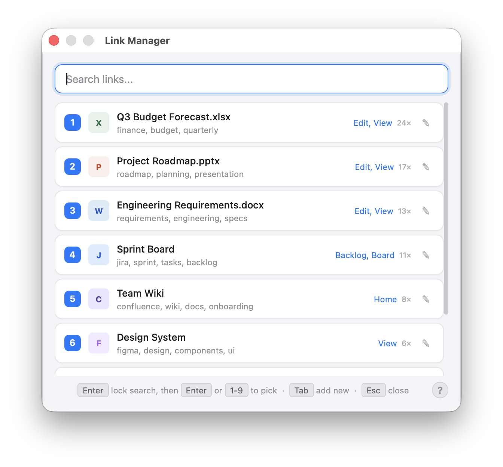
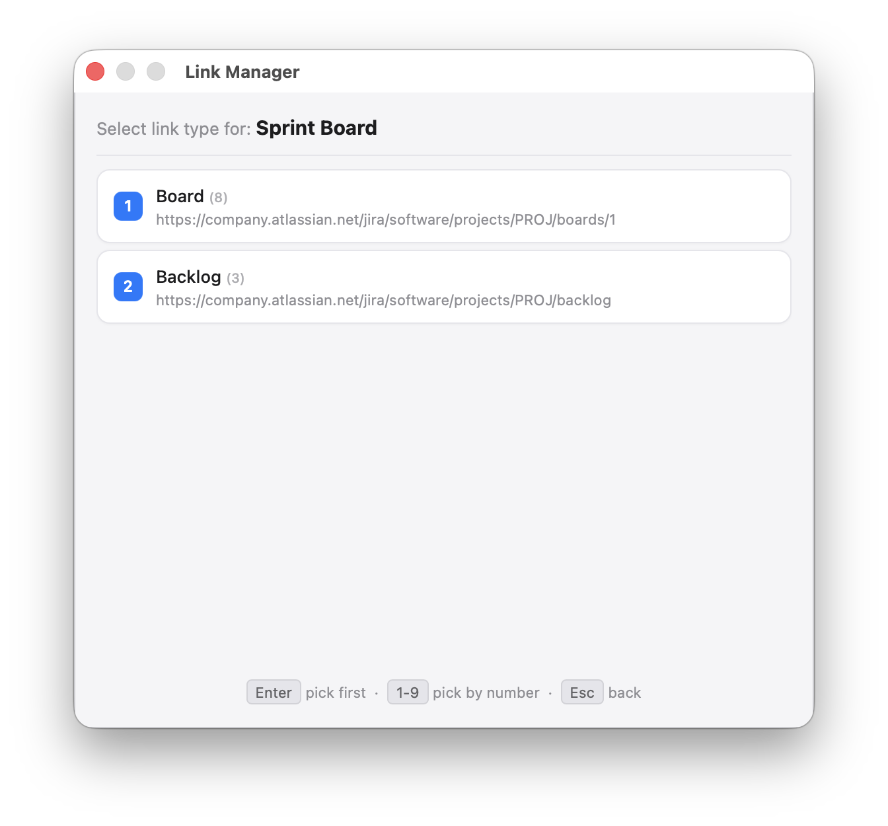
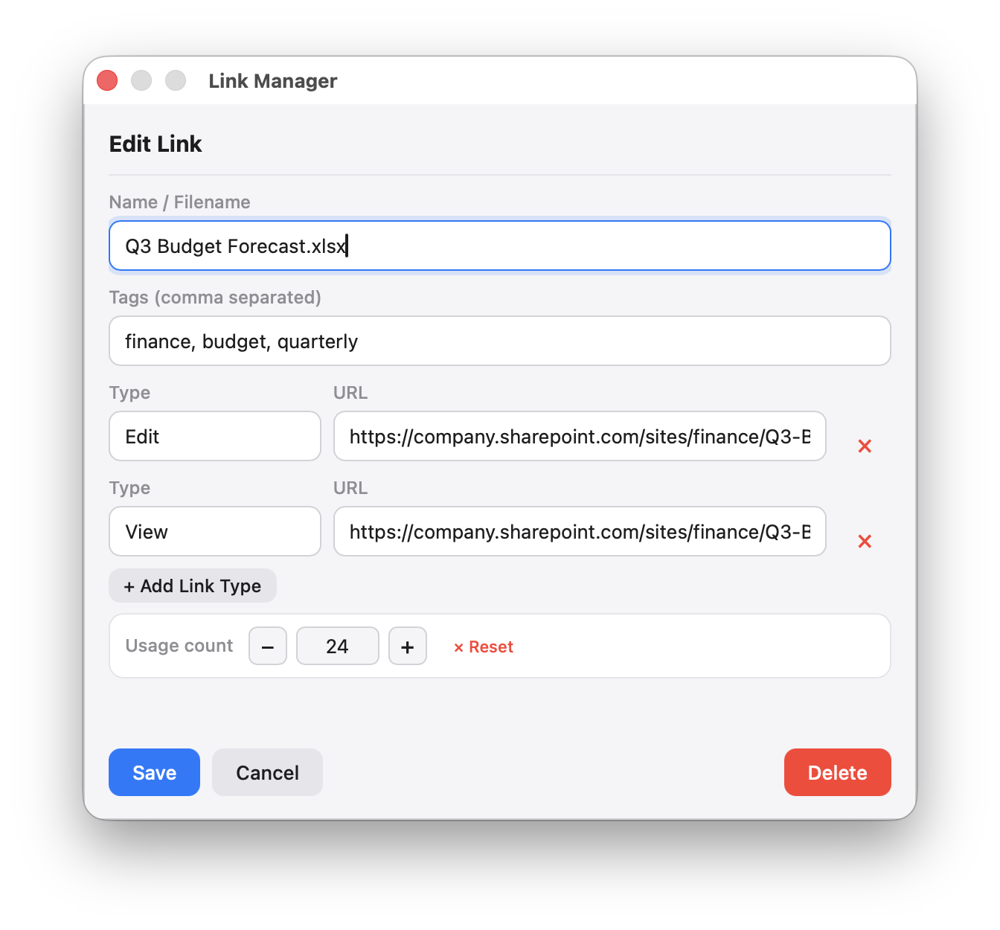
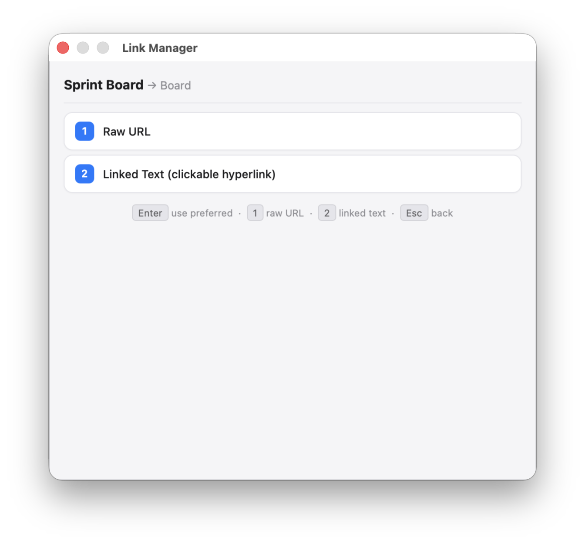
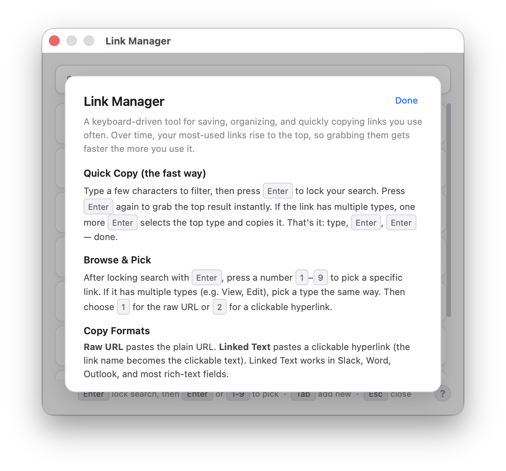

# Link Manager for macOS

A keyboard-driven link manager for macOS — save, tag, and instantly copy frequently used links with smart priority ranking. Built with [Hammerspoon](https://www.hammerspoon.org/).



## Why?

If you regularly share the same links — SharePoint docs, Jira boards, Confluence pages, Google Sheets — you've probably wasted time digging through bookmarks, Slack threads, or browser history to find the right URL. Link Manager keeps all of them in one place, and lets you copy any link in under two seconds using just your keyboard.

## Features

- **Keyboard-first workflow** — type a few characters, press Enter twice, and the link is on your clipboard
- **Smart priority** — links you use most automatically sort to the top, so they get faster to grab over time
- **Two copy formats** — paste a raw URL or a rich clickable hyperlink (works in Slack, Outlook, Word, Teams, etc.)
- **File type icons** — auto-detected from the link name or URL (Word, Excel, PowerPoint, PDF, Jira, Confluence, SharePoint, GitHub, Figma, and more)
- **Tagging** — add comma-separated tags for flexible search across names and tags
- **Multiple link types per entry** — store View, Edit, Board, Backlog, or any custom types under a single entry
- **Usage tracking** — copy counts are tracked per link, per type, and per format with manual override in the editor
- **macOS-native look** — clean, light UI styled after native macOS panels

## Screenshots

| Search | Type Selection | Edit View |
|--------|---------------|-----------|
|  |  |  |

| Format Selection | Help |
|-----------------|------|
|  |  |

## Requirements

- macOS
- [Hammerspoon](https://www.hammerspoon.org/) (free, open source)

## Installation

1. **Install Hammerspoon** if you haven't already — download from [hammerspoon.org](https://www.hammerspoon.org/) or install via Homebrew:
   ```bash
   brew install --cask hammerspoon
   ```

2. **Copy the script** into your Hammerspoon config directory:
   ```bash
   cp link-manager.lua ~/.hammerspoon/init.lua
   ```

   > If you already have an `init.lua`, you can paste the Link Manager section into your existing config or use `require` to load it as a module.

3. **Reload Hammerspoon** — the config auto-reloads on file changes, or click the Hammerspoon menu bar icon → Reload Config.

4. **Open Link Manager** with `Ctrl + Alt + L`.

## Quick Start

1. Press `Ctrl + Alt + L` to open Link Manager
2. Press `Tab` to add your first link — give it a name (include the file extension like `.docx` for auto icons), optional tags, and one or more URLs
3. To copy a link: start typing to filter, press `Enter` to lock your search, then `Enter` again to grab the top result — done

## Usage Guide

### The Fast Way (Enter → Enter)

This is the primary workflow once you have links saved:

1. `Ctrl + Alt + L` — open Link Manager
2. Type a few characters to filter (e.g., `budget`)
3. `Enter` — locks the search (border turns green)
4. `Enter` — copies the top result with your preferred format
5. If the link has multiple types, one more `Enter` picks the top type

Over time, your most-used links, types, and formats rise to the top, so the same keystrokes always grab what you need most.

### Browse & Pick

After locking search with `Enter`, press `1`–`9` to pick a specific link by number. Then pick a type and choose between raw URL (`1`) or linked text (`2`).

### Copy Formats

- **Raw URL** — pastes the plain URL as text
- **Linked Text** — pastes a clickable hyperlink where the link name becomes the clickable text. Works in Slack, Microsoft Word, Outlook, Teams, Google Docs, and most rich-text fields.

### Keyboard Shortcuts

| Key | Action |
|-----|--------|
| `Ctrl + Alt + L` | Open / close Link Manager |
| `Enter` | Lock search → select top result → select top type |
| `1` – `9` | Pick a numbered item |
| `Tab` | Add a new link |
| `Esc` | Go back one step or close |
| `?` | Toggle help screen |
| `⌘ + Enter` | Quick-save when editing |

## Sample Data

A sample `links.json` is included in this repo with generic demo links. To try it out:

```bash
cp links.json ~/.hammerspoon/links.json
```

Your real link data is stored at `~/.hammerspoon/links.json` and is never overwritten by the script — it's just read and written by the Link Manager.

## File Type Icons

Icons are auto-detected in this order:
1. **File extension in the link name** — e.g., `Budget.xlsx` → Excel icon
2. **URL patterns** — e.g., `atlassian.net/jira` → Jira icon

Supported types: Word, Excel, PowerPoint, PDF, CSV, OneNote, Visio, MS Project, Jira, Confluence, SharePoint, Google Docs/Sheets/Slides/Drive, GitHub, Figma, Miro, and Microsoft Teams.

## How It Works

The script creates a floating webview panel with an HTML/CSS/JS interface. Links are stored in a simple JSON file. The UI communicates with Hammerspoon's Lua runtime to handle clipboard operations (including rich-text hyperlinks via AppleScript) and window management.

## License

MIT — do what you want with it.
